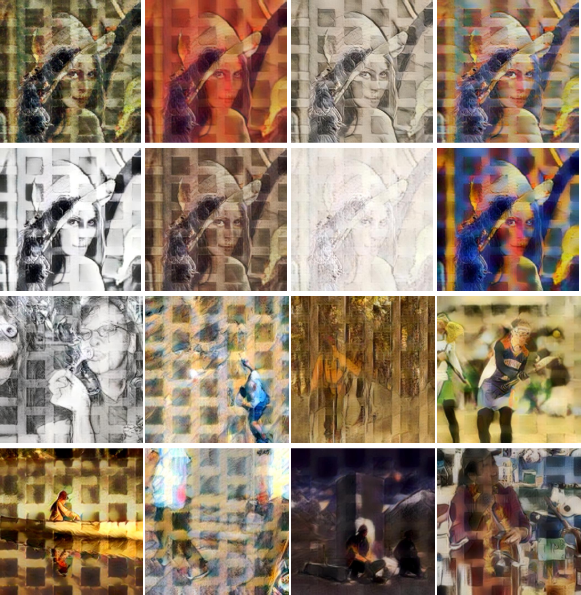
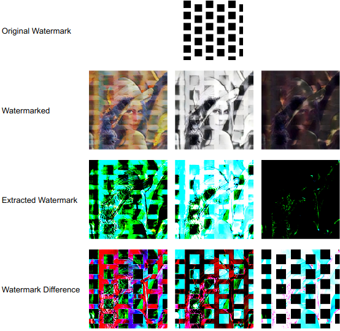

# Neural Style Transfer Watermark Detection

This project investigates whether image-based watermarks can survive NST and proposes a
novel frequency-domain embedding method using hybrid DCT-DWT techniques, guided by a
Generative Adversarial Network (GAN).

## Research Overview

Despite Neural Style Transfer dramatically altering pixel distributions, high-level feature representations extracted from VGG19 retain structural traces of embedded watermarks, enabling possible detection.


**Research Question**: Can embedded watermarks be reliably detected in images that have undergone neural style transfer?

## Paper

Full paper can found in [paper.pdf](./paper.pdf).

## Key Findings

- Watermark traces persist in VGG19 feature representations after NST
- Detection accuracy: 91.3% using combined DCT/DWT approach
- Deeper CNN layers show stronger watermark preservation
- Results consistent across various artistic styles

## Installation

```bash
git clone https://github.com/Magicmaan/copyright-dissertation.git
cd copyright-dissertation
pip install -r requirements.txt
```

**Requirements**: Python 3.8+, PyTorch 2.6.0+, CUDA-capable GPU (recommended)

## Usage

```bash
# Run main pipeline
python src/main.py
```

## Results

## Results
Quantitative Differences Between Original Watermark and Extracted Watermark

| Metric | Average Value |
|--------|---------------|
| Pixel Difference | 0.40 |
| PSNR | 52.68 |
| Perceptual Difference | 5.28 |
| SSIM | 0.28 |


## Images








