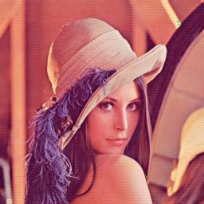
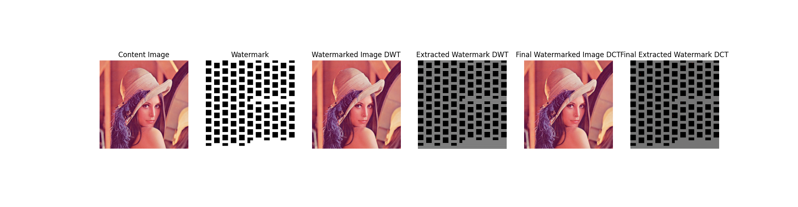
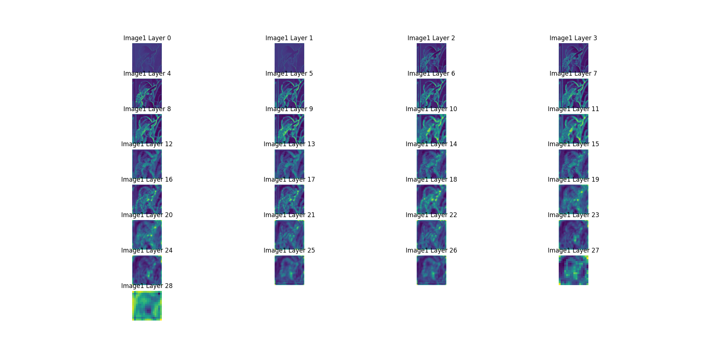

### First Test 02/04/25
First test began after first full implementation of DCT DWT.
[GitHub Repository for Neural Style Transfer](https://github.com/Magicmaan/Neural-Style-Transfer)

## Parameters
* DCT Alpha - 0.001
* DCT Alpha - [0.0001, 0.004, 0.004, 0.004]

# Results
* MSE Difference:  tensor(0.0365)
* Perceptual Difference:  0.040790580213069916
* Structural Difference:  tensor(0.9745)
* Peak Noise:  90.4090805053711

# Images

    

        
        
Input

    

    

        
        
Output

    

The stages of copyright embedding

### Features Extracted from the Watermarked Image

Zoom in to observe the following details:

1. **Mild Pattern Retention**:  
    - Notice the subtle patterns retained in the second row (layers 4–7).

2. **Distortion in Lower Layers**:  
    - Observe the distortions generated in some of the lower layers.

These features highlight the impact of the watermarking process on the image's structure.

