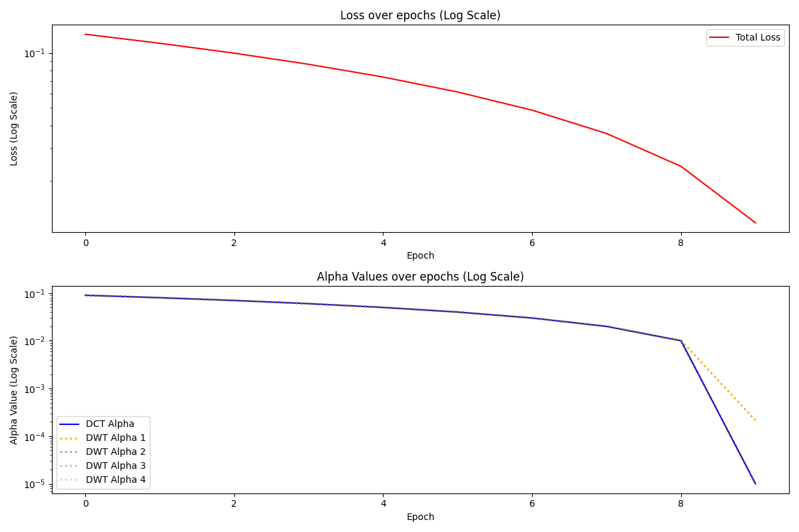

## WATERMARK DST/DWT OPTIMISATION


| Optimisation Type | Values                                                                 |
|-------------------|------------------------------------------------------------------------|
| DCT               | 9.999999747378752e-06                                                |
| DWT               | 9.999999747378752e-06, 9.999999747378752e-06, 9.999999747378752e-06, 9.999999747378752e-06 |

* The watermark gets successfully embedded using training
* Model fails to understand differences in parameters, as it sees each to have equal weight. hence all DWT being the same

## Full ADAIN optimisation

the style


### Related files:
| Image                          | Description                  |
|--------------------------------|------------------------------|
|  | Watermarked             |
|  | ADAIN Styled Watermark        |


### ADAIN Watermarked Features

| Image                                      | Description                        |
|-------------------------------------------|------------------------------------|
|  | ADAIN Watermarked Features         |
|  | ADAIN Styled Watermarked Features  |



| Optimisation Type | Final Alpha Values                                                                 |
|-------------------|------------------------------------------------------------------------------------|
| DCT               | 9.999999747378752e-06                                                             |
| DWT               | 4.283118323655799e-05, 9.999999747378752e-06, 9.999999747378752e-06, 9.999999747378752e-06 |

## Parameters

The following parameters were used to adjust the loss weights, giving more emphasis to the watermark loss:

```python
parameters = {
    "pixel": 0.3,  # Visual quality preservation
    "adversarial": 1.5,  # Adversarial loss for watermark detection
    "dwt_weights": 0.8,  # DWT alphas weight
}
```

* first proper run of optimising watermark for AST.
* ADAIN model is chosen for NST as speed is greater than gatys.
* ADAIN shows major artifacting compared to gatys. something that isn't present in the unstyled watermark. This is a cool consequence and unexpected.
* Visible appearance of watermark post NST isn't prioritised, since it doesn't matter if the potential copyright infringers attempts lead to worse results

* Uses a watermark detector network to optimise for NST end results.
* Proper weighting of DWT values is learnt as model understands that the higher alphas give more effect
* Adversarial hyper-parameter is kept higher to ensure model priortises it over others.
* Despite no changes to parameters or optimisation learning rates. the rate is far lower. most likely due to watermark detector network having slower learning rate.
# Full GATYS optimisation

* performed same as ADAIN, just using gatys instead

# Issues from this


* The adversarial loss ( detection of watermark ) shows to be decreasing, it should be increasing. Indicating the model isn't detecting the watermark ( its confident at start as theirs more overall visibility, making the watermark less distorted)


* model shows no preservation of watermark using dct coefficiets


## Progrss

* comparing the feature maps of extracted watermarks. obtained from an extractor network
* shows more visibility, but pattern is actually preserved


